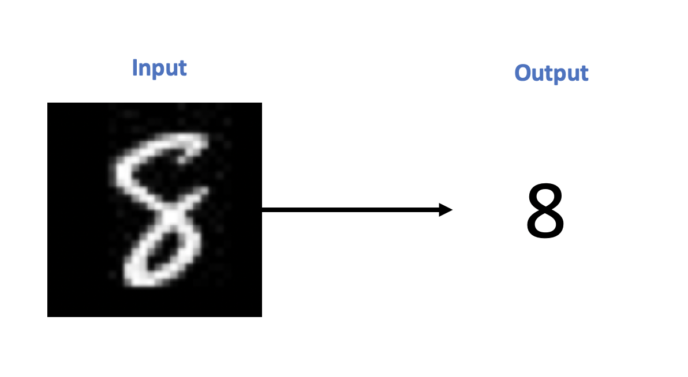

[](https://travis-ci.org/SSaishruthi/max_mnist)

# MAX-MNIST

Classify the handwritten digits. 



Data Source: http://yann.lecun.com/exdb/mnist/

Framework: Keras

# Steps

1. [Fork the Template and Clone the Repository](#fork-the-template-and-clone-the-repository)
2. [Update Dockerfile](#Update-dockerfile)
3. [Update Package Requirements](#update-package-requirements)
4. [Update API and Model Metadata](#update-api-and-model-metadata)
5. [Update Scripts](#update-scripts)
6. [Build the model Docker image](#build-the-model-docker-image)
7. [Run the model server](#run-the-model-server)

## Fork the Template and Clone the Repository

1. Login to GitHub and go to [MAX Skeleton](https://github.com/IBM/MAX-Skeleton)

2. Click on `Use this template` and provide a name for the repo.

3. Clone the newly created repository using the below command:

```bash
$ git clone https://github.com/......
```

## Update Dockerfile

Update,

- `ARG model_bucket=` with the link to the model file public storage that can be downloaded
- `ARG model_file=` with the model file name. 
   
For testing purpose, update as below:

`model_bucket = https://github.com/SSaishruthi/max_mnist/raw/master/samples/model_structure.h5`
`model_file = model_structure.h5`

Calculate and add the MD5 hashes of the files that will be downloaded to md5sums.txt. 

Here, hash will be calculated for `model_structure.h5` using the command:

```
md5sum model_structure.h5
```

## Update Package Requirements

Add required python packages for running the model prediction to requirements.txt. 

Following packages are required for this model:

   - numpy==1.14.1
   - Pillow==5.4.1
   - h5py==2.9.0
   - keras==2.2.4
   - tensorflow==1.12.2
   

## Update API and Model Metadata

1. In `config.py`, update the API metadata.

  - API_TITLE 
  - API_DESC 
  - API_VERSION 

2. Set `DEFAULT_MODEL_PATH = 'assets/model_structure.h5'`

   _NOTE_: Model files are always downloaded to `assets` folder inside docker. That's the reason for updating the
`  DEFAULT_MODEL_PATH` as `assets/model_structure.h5`

3. In `code/model.py`, fill in the `MODEL_META_DATA` 
       
     - Model id
     - Model name
     - Description of the model
     - Model type based on what the model does (e.g. Digit recognition)
     - Source to the model belongs
     - Model license
   
## Update Scripts

All you need to start wrapping your model is pre-processing, prediction and post-processing code.
  
1. In `code/model.py`, load the model under `__init__()` method. 
  Here, saved model `.h5` can be loaded using the below command:
  
 ```
  # load the model using `load_model` keras function
  self.model = load_model(path)
  self.model._make_predict_function()
 ```

Reference:
https://keras.io/getting-started/faq/

2. In `code/model.py`, pre-processing functions required for the input should get into the `_pre_process` function.
   Here, the input image needs to be read and converted into an array of acceptable shape.
  
  ```
  # Open the input image
  img = Image.open(io.BytesIO(inp))
  print('reading image..', img.size)
  # Convert the PIL image instance into numpy array and
  # get in proper dimension.
  image = img_to_array(img)
  print('image array shape..', image.shape)
  image = np.expand_dims(image, axis=0)
  return image
  ```
     
  _NOTE_: Pre-processing is followed by prediction function which accepts only one input, 
          so create a dictionary to hold the return results if needed. In this case, we only have one input so we
          are good to go.
             
3. Predicted digit and its probability are the expected output. Add these two fields to `label_prediction` in `api/predict.py` 
  
 ```
 label_prediction = MAX_API.model('LabelPrediction', {
 'prediction': fields.Integer(required=True),
 'probability': fields.Float(required=True)
 })
 ```
 
 _NOTE_: These fields can very depending on the model.
 
4. Place the prediction code under `_predict` method in `code/model.py`.
   In the above step, we have defined two outputs. Now we need to extract these two results 
   from the model. 
  
   _NOTE_: Prediction is followed by post-processing function which accepts only one input, 
           so create a dictionary to hold the results in case of multiple outputs returned from the function.
  
 ```
   predict_result = self.model.predict(x),
   return predict_result
 ```
     
5. Post-processing function will go under `_post_process` method in `code/model.py`.
   Result from the above step will be the input to this step. 
  
   Here, result from the above step will contain prediction probability for all 10 classes (digit 0 to 9).
  
   Output response has two fields `status` and `predictions` as defined in the `api/predict.py`. 
  
  ```
   predict_response = MAX_API.model('ModelPredictResponse', {
     'status': fields.String(required=True, description='Response status message'),
     'predictions': fields.List(fields.Nested(label_prediction), description='Predicted labels and probabilities')
   })
  ```
  
   Predictions is of type list and holds the model results. Create a dictionary inside a list with key names used in `label_prediction` (step 4) and update the
   model results accordingly.
   
   ```
   # Extract prediction probability using `amax` and
   # digit prediction using `argmax`
   return [{'probability': np.amax(result),
            'prediction': np.argmax(result)}]
   ```

6. Assign the result from post-processing to the appropriate response field in `api/predict.py`.

  ```
  # Assign result
  result['predictions'] = preds
  ```

7. Add test images to `samples/`

## Build the model Docker image

To build the docker image locally, run:

```
$ docker build -t max-mnist .
```

If you want to print debugging messages make sure to set `DEBUG=True` in `config.py`.

## Run the model server

To run the docker image, which automatically starts the model serving API, run:

```
$ docker run -it -p 5000:5000 max-mnist
```

## BONUS - Update Test Script

1. Add a few integration tests using pytest in tests/test.py to check that your model works. 

   Example:

   - Update model endpoint and sample input file path.

 ```
    model_endpoint = 'http://localhost:5000/model/predict'
    file_path = 'samples/image0.jpeg'
 ```

   - Check if the prediction is `8`.

 ```
    assert response['predictions'][0]['prediction'] == 8
 ```

2. To enable Travis CI testing uncomment the docker commands and pytest command in `.travis.yml`.
